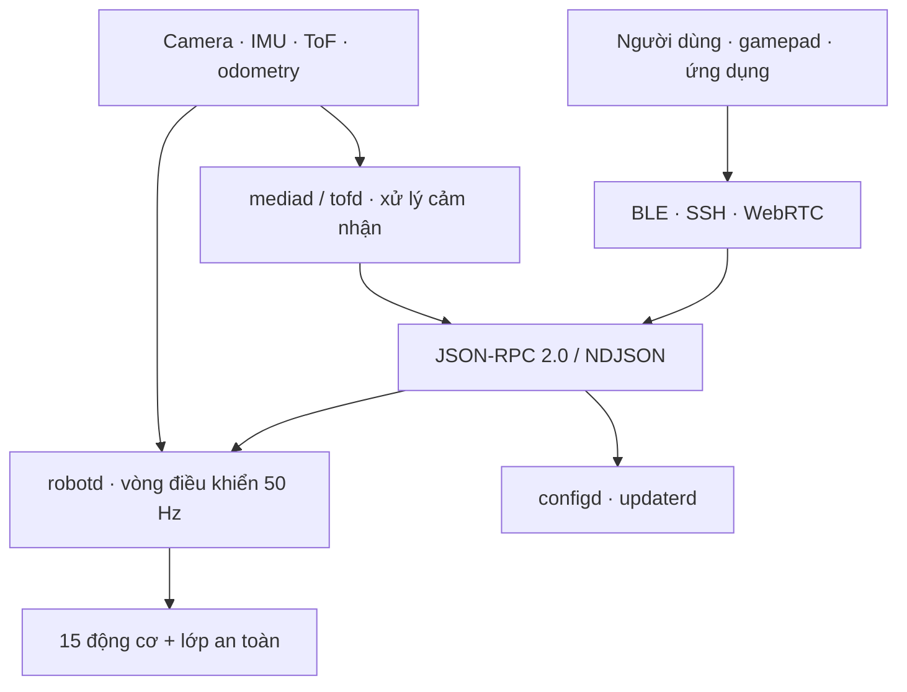
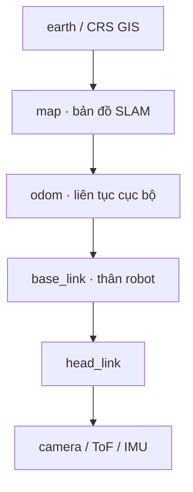
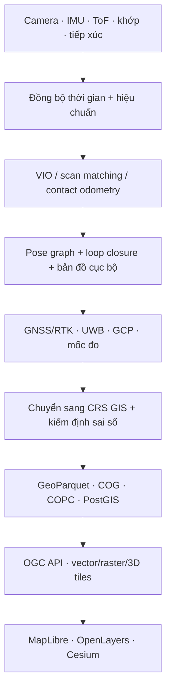

<p align="center">
  
</p>

<h1 align="center">Microduck cho SLAM, GeoAI và WebGIS</h1>

<p align="center">
  <em>Phân tích bản chất, nguyên lý hoạt động, kiến trúc hệ thống và triển vọng phát triển thành một nền tảng robot thu nhận dữ liệu không gian.</em>
</p>

<p align="center">
  <a href="https://pollen-robotics.com/microduck"><b>Trang Microduck chính thức</b></a> ·
  <a href="docs/robot/cheatsheet.md">Hướng dẫn nhanh</a> ·
  <a href="https://github.com/pollen-robotics/microduck_rl">Huấn luyện chính sách</a> ·
  <a href="docs/design/architecture.md">Kiến trúc hệ thống</a> ·
  <a href="CONTRIBUTING.md">Đóng góp</a> ·
  <a href="https://github.com/pollen-robotics/microduck/blob/main/README.md">Bản gốc tiếng Anh</a>
</p>

<p align="center">
  <a href="https://github.com/pollen-robotics/microduck/actions/workflows/ci.yml"></a>
  
  
</p>

> [!IMPORTANT]
> **Bản Việt hóa, hiệu đính và phát triển theo hướng bài báo khoa học: Long Ngo (Vietflexmap), 2026.** Đây là một bài tổng quan kỹ thuật và đề xuất nghiên cứu độc lập dựa trên mã nguồn cùng tài liệu công khai của Pollen Robotics; không phải công bố chính thức của nhóm phát triển và chưa qua phản biện đồng cấp.

> [!NOTE]
> Trạng thái được đối chiếu ngày **05/09/2026**. Tài liệu phân biệt ba mức bằng chứng: **đã có trên nhánh `main`**, **đang thử nghiệm ở nhánh/PR**, và **đề xuất phát triển**. Thông số phần cứng trước khi giao hàng vẫn có thể thay đổi.

## Tóm tắt

Microduck là robot hai chân cỡ nhỏ, cao khoảng 25 cm và nặng dưới 800 g, sử dụng 15 cơ cấu chấp hành cùng bộ điều khiển chính sách học tăng cường chạy tại 50 Hz trên nền tảng Rockchip RK3566. Phần mềm được tổ chức thành các dịch vụ Rust độc lập: điều khiển chuyển động, cấu hình mạng, Bluetooth, camera/WebRTC, cảm biến độ sâu ToF và cập nhật phần mềm có xác minh, kiểm tra sức khỏe và quay lui. Chính sách vận động được huấn luyện trong MuJoCo bằng PPO, chuyển sang ONNX và triển khai trên robot theo quy trình sim-to-real.

Xét về bản chất, Microduck **chưa phải một robot GIS hoặc hệ SLAM hoàn chỉnh**. Nhánh chính chưa tích hợp GPS/GNSS, ROS, cơ sở dữ liệu không gian, thuật toán visual-inertial SLAM hay máy chủ WebGIS. Tuy nhiên, robot có nhiều thành phần tiền đề: camera trước, hai IMU theo đặc tả dự kiến, ma trận ToF 8×8, odometry tiếp xúc, động học đầu–thân, kết nối Wi-Fi/Bluetooth, WebRTC và kiến trúc phần mềm cô lập vòng điều khiển thời gian thực khỏi tác vụ cảm nhận nặng. Một PR thử nghiệm mang tên `maploc` đã chứng minh hướng lập bản đồ lưới chiếm chỗ và tái định vị từ ToF, đồng thời chỉ ra các sai số thực tế như bất đối xứng gốc cảm biến, nhiễu khoảng 9 cm, đóng vòng giả và thiếu góc quan sát.

Bài viết kết luận rằng Microduck có tiềm năng cao cho **giáo dục robot–SLAM, nghiên cứu GeoAI trong nhà, bản đồ vi mô, bản sao số và thí nghiệm đa robot**, nhưng chỉ đạt giá trị GIS đáng tin cậy khi bổ sung đồng bộ thời gian, hiệu chuẩn nội/ngoại tại, mô hình hệ tọa độ, cơ chế tham chiếu địa lý, chuẩn dữ liệu không gian và đánh giá định lượng bằng ground truth. Với khảo sát địa hình hoặc đo đạc pháp lý, cấu hình hiện tại không thể thay thế thiết bị GNSS/RTK, LiDAR khảo sát hay toàn đạc điện tử.

**Từ khóa:** Microduck; robot hai chân; embodied AI; học tăng cường; sim-to-real; SLAM; visual-inertial odometry; GIS; WebGIS; GeoAI; bản đồ đa robot.

## 1. Câu hỏi nghiên cứu và phương pháp đánh giá

Bài tổng quan trả lời năm câu hỏi:

1. Microduck thực chất là loại nền tảng nào và cơ chế vận hành ra sao?
2. Những thành phần nào đã sẵn sàng cho SLAM/GIS, những thành phần nào còn thiếu?
3. Làm thế nào chuyển bản đồ cục bộ của robot thành dữ liệu GIS có hệ tọa độ và nguồn gốc rõ ràng?
4. Kiến trúc nào phù hợp để truyền dữ liệu từ robot lên WebGIS mà không làm gián đoạn vòng điều khiển 50 Hz?
5. Tiềm năng ứng dụng đến đâu nếu đánh giá bằng tiêu chí khoa học thay vì chỉ dựa trên trình diễn?

Phương pháp là **phân tích kiến trúc và bằng chứng trong repository**: đối chiếu `README`, tài liệu thiết kế, roadmap, mã nguồn các crate chính, đặc tả sản phẩm và PR `maploc`; sau đó so sánh với nguyên lý SLAM, mô hình dữ liệu GIS và tiêu chuẩn WebGIS. Bài viết không tuyên bố kết quả thực địa ngoài những số liệu đã được tác giả PR công bố.

| Mức bằng chứng | Ý nghĩa trong bài |
|---|---|
| **A - Đã hiện hữu** | Có trên nhánh `main`, tài liệu chính thức hoặc đặc tả sản phẩm hiện hành. |
| **B - Thử nghiệm** | Có mã/đo đạc trong PR hay nhánh chưa hợp nhất; không được xem là tính năng sản phẩm ổn định. |
| **C - Đề xuất** | Kiến trúc và giả thuyết do bản phân tích này phát triển; cần triển khai và kiểm chứng. |

## 2. Bản chất của Microduck

Microduck nên được hiểu là một **nền tảng embodied AI biên** gồm bốn lớp gắn chặt với nhau:

1. **Cơ thể cơ điện tử:** 15 bậc tự do ở chân, đầu và cổ; mỏ có khớp; robot có thể đi, ngồi, đá, gắp, trượt bằng bánh gắn ngoài và tự đứng dậy.
2. **Vòng điều khiển an toàn:** `robotd` đọc trạng thái, tạo quan sát, suy luận chính sách, áp ràng buộc an toàn và phát lệnh động cơ ở 50 Hz.
3. **Năng lực học:** hành vi được huấn luyện trong mô phỏng, xuất ONNX rồi triển khai lên phần cứng; người dùng có thể thay đổi chính sách mà không phải viết lại toàn bộ bộ điều khiển.
4. **Hạ tầng sản phẩm:** dịch vụ cấu hình, Bluetooth, camera, ToF, cập nhật có chữ ký, health gate và rollback làm cho robot có thể vận hành, chẩn đoán và nâng cấp như một thiết bị biên thực thụ.

Điểm quan trọng là phải tách **năng lực vận động** khỏi **năng lực lập bản đồ**. Chính sách học tăng cường trả lời câu hỏi “robot nên điều khiển khớp như thế nào để thực hiện hành vi?”, còn SLAM trả lời “robot đang ở đâu và môi trường có cấu trúc ra sao?”. Một robot đi tốt không tự động có bản đồ tốt; ngược lại, một hệ SLAM chính xác không tự động bảo đảm bước đi ổn định.

### 2.1 Mã nguồn mở đến đâu?

Phần mềm Microduck được cấp phép Apache-2.0. Theo press kit chính thức, tuyên bố mã nguồn mở **chỉ áp dụng cho phần mềm**; thiết kế cơ khí và điện tử không được công bố như phần cứng mã nguồn mở. Vì vậy, mô tả “toàn bộ phần cứng mở, có thể tự do chế tạo lại” là không chính xác tại thời điểm đánh giá.

Việc gắn thêm GNSS, LiDAR quét, camera stereo hay cảm biến đa phổ vẫn có thể thực hiện ở cấp độ nghiên cứu, nhưng cần tự thiết kế gá lắp, nguồn điện, driver, đồng bộ thời gian, mô hình ngoại tại và kiểm tra tải trọng. Khả năng “gắn được” không đồng nghĩa với “được hỗ trợ sẵn”.

## 3. Cấu hình phần cứng và phần mềm hiện tại

### 3.1 Phần cứng

| Thành phần | Thông tin công khai | Ý nghĩa đối với SLAM/GIS |
|---|---|---|
| Kích thước và khối lượng | Cao 25 cm, rộng khoảng 14 cm, dưới 800 g | Phù hợp không gian trong nhà và mô hình thu nhỏ; tải cảm biến bổ sung bị giới hạn. |
| Chuyển động | 15 động cơ/bậc tự do; vòng chính sách 50 Hz | Cơ động hơn xe bánh trong một số tình huống, nhưng dao động thân và trượt chân làm odometry khó hơn. |
| Máy tính | Rockchip RK3566 có bộ tăng tốc AI; 1 GB RAM, 32 GB lưu trữ | Đủ cho điều khiển, mã hóa video và mô hình nhỏ; SLAM 3D nặng có thể cần tối ưu hoặc máy tính đồng hành. |
| Camera | Camera trước; mã/tài liệu hiện tham chiếu IMX219 | Có thể dùng visual odometry, nhận dạng và ghi ảnh; độ phân giải/FOV cuối cùng còn được nhà sản xuất hoàn thiện. |
| Cảm biến khoảng cách | “Compact LiDAR” dạng ma trận ToF 8×8; daemon hiện phát ở 15 Hz | Hữu ích tránh vật cản và occupancy grid cự ly phòng; **không tương đương LiDAR quay 2D/3D độ phân giải cao**. |
| Cảm biến quán tính | Đặc tả dự kiến gồm hai IMU, một ở thân và một ở đầu | Là tiền đề cho VIO; cần xác nhận driver, timestamp, tốc độ lấy mẫu và ngoại tại của cả hai IMU. |
| Odometry | Odometry tiếp xúc nằm trong vòng `robotd` | Có thể cung cấp prior chuyển động, nhưng tích lũy drift khi chân trượt hoặc robot đổi dáng. |
| Kết nối | Wi-Fi và Bluetooth; camera/audio qua WebRTC | Thuận lợi cho telemetry và giám sát WebGIS; WebRTC tự nó không phải mô hình dữ liệu GIS. |
| Nguồn | Pin NP-F550 2600 mAh tháo rời; thời lượng dự kiến khoảng một giờ tùy tải | Thuật toán SLAM, truyền video và cảm biến bổ sung sẽ làm thay đổi ngân sách năng lượng. |

### 3.2 Kiến trúc dịch vụ

| Dịch vụ/crate | Trách nhiệm chính | Liên hệ với GeoAI |
|---|---|---|
| `robotd` | Vòng điều khiển 50 Hz, bus động cơ, động học, odometry, chính sách và an toàn | Nguồn pose/khớp có thẩm quyền; không nên gánh xử lý bản đồ nặng. |
| `duck-control` | Mô hình robot, IMU, quan sát, suy luận ONNX và giới hạn an toàn | Lớp điều khiển xác định chất lượng chuyển động và dữ liệu đầu vào. |
| `mediad` | Camera, microphone, mã hóa phần cứng, WebRTC và đặc trưng thị giác | Điểm đặt hợp lý cho front-end thị giác hoặc trích xuất feature gần cảm biến. |
| `tofd` | Xuất ma trận độ sâu 8×8 qua socket riêng | Nguồn range data cho tránh vật cản và bản đồ lưới thô. |
| `configd` | Wi-Fi, danh tính robot, ghép nối và nguồn | Cấu hình fleet và nhận dạng thiết bị. |
| `btd` / `padd` | Cầu Bluetooth và gamepad thành các “ý định” điều khiển | Các adapter transport, không sở hữu trạng thái robot. |
| `updaterd` | Xác minh, cài đặt, health gate và rollback bản phát hành | Tạo điều kiện thí nghiệm lặp lại trên nhiều robot với phiên bản đồng nhất. |
| `robotctl` / `duckctl` | CLI vận hành qua socket, mạng hoặc Bluetooth | Điểm mở rộng cho ghi log, hiệu chuẩn, xuất dữ liệu và điều khiển thí nghiệm. |



Kiến trúc dùng **một writer có thẩm quyền cho mỗi trạng thái** và tách control plane khỏi data plane. Lệnh nhỏ đi qua JSON-RPC/NDJSON trên Unix socket; khung hình lớn nằm trong pipeline media. Đây là quyết định tốt cho SLAM: thuật toán bản đồ có thể chạy trong worker riêng, nhận bản sao trạng thái mới nhất và bị dừng mà không làm mất quyền kiểm soát động cơ.

## 4. Nguyên lý học tăng cường và sim-to-real

Các chính sách chuyển động được huấn luyện trong repository [`microduck_rl`](https://github.com/pollen-robotics/microduck_rl) bằng MuJoCo và PPO. Một chu trình khái quát gồm:

1. Xây dựng mô hình động lực học của robot trong mô phỏng.
2. Tạo quan sát gồm trạng thái quán tính, tư thế/tốc độ khớp, lệnh chuyển động và hành động trước đó.
3. PPO tối ưu tham số chính sách để tăng phần thưởng cho bám vận tốc, giữ thăng bằng, tiết kiệm năng lượng và tránh hành vi không an toàn.
4. Domain randomization làm biến thiên ma sát, khối lượng, độ trễ và nhiễu để giảm khoảng cách mô phỏng–thực tế.
5. Mạng được xuất sang ONNX và nạp bởi `robotd`.
6. Trong mỗi tick 20 ms, `robotd` đọc cảm biến, tạo vector quan sát, suy luận hành động, áp giới hạn an toàn rồi điều khiển động cơ.

Với họ chính sách hiện tại, repository kiểm tra chặt hình dạng quan sát 61 chiều. Mô hình khái quát có thể viết:

```math
a_t = \pi_{\theta}(o_t), \qquad o_t = f(\omega_t, g_t, q_t, \dot q_t, a_{t-1}, c_t),
```

trong đó $o_t$ là quan sát, $a_t$ là lệnh hành động, $q_t$ và $\dot q_t$ là vị trí/tốc độ khớp, $\omega_t$ là vận tốc góc, $g_t$ là hướng trọng lực ước lượng và $c_t$ là lệnh cấp cao.

PPO không “học bản đồ” trong cấu hình hiện tại. Có thể dùng học tăng cường cho chiến lược khám phá - chẳng hạn thưởng vùng mới và phạt va chạm - nhưng pose, loop closure và hệ tọa độ vẫn cần một bộ ước lượng trạng thái có thể kiểm tra được. Cách an toàn là để RL điều khiển **hành vi khám phá**, còn SLAM/GIS cung cấp **trạng thái không gian và bản đồ**.

## 5. Từ cảm biến đến SLAM

### 5.1 SLAM thực hiện điều gì?

SLAM đồng thời ước lượng quỹ đạo robot và cấu trúc môi trường từ các phép đo có nhiễu. Một mô hình tối ưu đồ thị tư thế có dạng:

```math
\hat{X} = \arg\min_X \sum_{(i,j)\in\mathcal{E}} \rho\left(\left\|z_{ij} \ominus h_{ij}(X)\right\|_{\Omega_{ij}}^2\right),
```

trong đó $X$ là các pose cần tìm, $z_{ij}$ là ràng buộc từ odometry, IMU, camera, ToF hoặc loop closure; $\Omega_{ij}$ biểu diễn độ tin cậy và $\rho$ là hàm mất mát bền vững với ngoại lệ.

Một hệ SLAM đầy đủ thường có:

- **Front-end:** đồng bộ và tiền xử lý cảm biến, theo dõi feature, scan matching, phát hiện tiếp xúc/trượt và tạo ràng buộc.
- **Back-end:** tối ưu pose graph hoặc factor graph, hiệu chỉnh drift, quản lý loop closure và bất định.
- **Map representation:** lưới chiếm chỗ 2D, point cloud, surfel, mesh hoặc semantic map.
- **Relocalization:** khôi phục pose khi tracking mất hoặc sau khi khởi động lại.

### 5.2 Vì sao robot hai chân khó hơn xe bánh?

Camera và cảm biến trên Microduck chịu chuyển động lắc tuần hoàn của thân/đầu, va chạm bàn chân, rung động mô-tơ, thay đổi chiều cao, motion blur và trượt chân. Odometry tiếp xúc không có tính ràng buộc lăn-không-trượt mạnh như bánh xe. Vì vậy, chất lượng SLAM phụ thuộc đặc biệt vào:

- timestamp đơn điệu và cùng miền thời gian cho camera, IMU, ToF, khớp và pose;
- hiệu chuẩn nội tại camera và mô hình rolling shutter nếu có;
- ngoại tại chính xác giữa thân, đầu, camera, ToF và từng IMU;
- động học đầu–cổ theo thời gian thay vì giả định cảm biến gắn cứng vào thân;
- phát hiện bước chân trượt, ngã, đứng yên và thay đổi chế độ đi/bánh;
- lọc frame mờ và quản lý vùng ít texture hoặc vật thể chuyển động.

### 5.3 Hệ khung tọa độ bắt buộc



`map` của SLAM là hệ mét cục bộ và thường có gốc tùy ý. Nó **không tự động trở thành GIS**. Muốn đặt dữ liệu lên bản đồ địa lý, phải ước lượng phép biến đổi từ hệ `map` sang một CRS đã biết bằng GNSS/RTK, UWB đã đo tọa độ, mốc khống chế/GCP, AprilTag có tọa độ hoặc total station. Dạng đơn giản:

```math
p_{GIS} = sR\,p_{map} + t,
```

với $R$ là phép quay, $t$ là tịnh tiến và $s$ là tỷ lệ khi hệ quan sát chưa bảo toàn thang đo. Sai số còn lại phải được báo cáo bằng RMSE tại các mốc kiểm tra độc lập.

### 5.4 Phương án thuật toán

| Phương án | Cảm biến | Điểm mạnh | Rủi ro trên Microduck | Mức phù hợp |
|---|---|---|---|---|
| `maploc` thử nghiệm | ToF 8×8 + odometry + động học đầu | Bám sát kiến trúc Rust và tài nguyên hiện có; tạo occupancy grid | FOV/range data thưa, loop closure dễ nhập nhằng; chưa hợp nhất vào `main` | Tốt cho baseline 2D trong phòng |
| ORB-SLAM3 | Camera đơn/stereo/RGB-D + IMU | Visual, visual-inertial và multi-map SLAM đã được công bố rộng rãi | Cần timestamp và calibration tốt; 1 GB RAM/CPU có thể là giới hạn | Tốt cho nghiên cứu VIO nếu tối ưu hoặc offload |
| RTAB-Map | RGB-D, stereo hoặc LiDAR | Lập bản đồ 2D/3D, loop closure và vận hành dài hạn | Stack nặng hơn, tích hợp Rust cần bridge; ToF 8×8 không phải RGB-D đầy đủ | Tốt với máy tính đồng hành/cảm biến nâng cấp |
| Cartographer 2D | LiDAR quét + IMU + odometry | Tối ưu submap và pose graph trưởng thành | Cần LiDAR quét thật; không nên coi ma trận 8×8 là laser scan tương đương | Phù hợp sau nâng cấp cảm biến |
| VIO/factor graph tùy biến | Camera + hai IMU + contact odometry | Tận dụng cấu hình đặc thù robot hai chân | Chi phí nghiên cứu và kiểm chứng cao | Hướng học thuật dài hạn |

## 6. Bằng chứng từ nhánh thử nghiệm `maploc`

PR [`pollen-robotics/microduck#127`](https://github.com/pollen-robotics/microduck/pull/127) là bằng chứng gần nhất cho tiềm năng SLAM trên phần cứng gốc. PR xây dựng `maploc` như một crate do `robotd` host trong worker ưu tiên thấp, lấy depth từ `tofd`, hiệu chỉnh theo tư thế và xuất lưới ba trạng thái. Nhóm phát triển đã xác định sáu nhóm lỗi quan trọng:

1. Gốc tia đo dùng không nhất quán giữa tạo bản đồ và định vị.
2. Tia ra ngoài bản đồ bị bỏ qua, khiến pose sai vẫn có điểm số đẹp.
3. Chỉ chấm endpoint làm xuất hiện nghiệm giả “nhìn xuyên tường”.
4. Frame thô tạo mức nhiễu khoảng 9 cm, lớn hơn ngưỡng loop closure.
5. Hiệu chỉnh pose graph không truyền về tracking đang hoạt động.
6. Loop closure giả làm hai phòng bị “gập” vào nhau.

Sau sửa lỗi và áp chiến lược **dừng–quét, tích lũy phiếu theo cell và quét đầu rộng**, phép thử tái định vị được báo cáo tăng từ 0/13 lên 6/20 probe trong ngưỡng 30 cm/20°. Kết quả này có ý nghĩa vì chỉ ra đúng cơ chế thất bại, nhưng tỷ lệ 6/20 vẫn chưa đủ để gọi là SLAM tin cậy. Đây nên được xem là baseline nghiên cứu có khả năng tái tạo, không phải chứng nhận hiệu năng sản phẩm.

Một kết luận thực nghiệm rất đáng giá là **robot chủ động quay đầu để tạo góc quan sát rộng** có thể quan trọng hơn việc liên tục ghi các lát ToF hẹp khi đang đi. Microduck có lợi thế ở đây: đầu có khớp, nên active perception có thể được tối ưu như một hành vi riêng.

## 7. Kiến trúc đề xuất: Microduck → SLAM → GIS → WebGIS



### 7.1 Nguyên tắc triển khai

- Không cho SLAM chặn vòng điều khiển. `robotd` chỉ đẩy snapshot/timestamp qua hàng đợi không chờ; worker bản đồ chạy độc lập và có thể bị restart.
- Gần cảm biến chỉ truyền **feature, depth hoặc frame được yêu cầu**, không sao chép video thô qua nhiều tiến trình nếu không cần.
- Mọi record phải có `robot_id`, `timestamp_ns`, `frame_id`, `pose`, ma trận hiệp phương sai, phiên bản calibration, commit phần mềm và phiên bản policy.
- Phân biệt `map`, `odom` và `earth`; không gán EPSG:4326 cho tọa độ cục bộ tính bằng mét.
- Khi đổi sang GeoJSON, tuân thủ thứ tự trục kinh độ–vĩ độ. Phép tính khoảng cách/diện tích phải thực hiện trong CRS chiếu phù hợp, không tính trực tiếp trên độ.
- Lưu dữ liệu phân tích ở GeoParquet/GeoPackage/COG; chỉ dùng Shapefile khi hệ thống cũ bắt buộc.

### 7.2 Sản phẩm dữ liệu nên xuất

| Sản phẩm | Trường tối thiểu | Định dạng lưu trữ | Cách phân phối WebGIS |
|---|---|---|---|
| Quỹ đạo robot | thời gian, pose, covariance, mode, quality | GeoParquet hoặc PostGIS | OGC API - Features / GeoJSON |
| Sự kiện | vật cản, ngã, ảnh chụp, phát hiện đối tượng, độ tin cậy | GeoPackage/PostGIS | Feature API + WebSocket sự kiện |
| Occupancy grid | resolution, origin, nodata, CRS, probability | COG hoặc Zarr theo thời gian | OGC API - Tiles / raster tiles |
| Point cloud | XYZ, intensity/range, timestamp, class | LAZ/COPC | 3D Tiles hoặc COPC range request |
| Semantic map | lớp tường, cửa, lối đi, tài sản, provenance | GeoParquet/PostGIS | Vector tiles / OGC API - Features |
| Telemetry | pin, nhiệt, CPU, loop Hz, dropped frames | Time-series DB | Dashboard thời gian thực |

### 7.3 Hai cấu hình WebGIS thực tế

**Cấu hình tĩnh, chi phí thấp:** robot ghi log → máy trạm xử lý SLAM và georeference → xuất GeoJSON/PMTiles/COG → hiển thị bằng MapLibre/OpenLayers/Cesium trên GitHub Pages. Phù hợp demo, dữ liệu khảo sát theo đợt và không cần máy chủ ghi liên tục.

**Cấu hình thời gian thực:** robot → gateway WebRTC/WebSocket/MQTT → dịch vụ ingest → PostGIS và object storage → OGC API/vector tiles/3D Tiles → WebGIS. Phù hợp fleet, giám sát và bản sao số. GitHub Pages không nên nhận vai trò backend ghi dữ liệu hay giữ khóa bí mật.

WebRTC hiện có là lợi thế lớn để truyền video và control channel, nhưng cần một lớp schema địa không gian phía trên. Một stream có hình ảnh đẹp vẫn chưa phải WebGIS nếu thiếu timestamp, pose, CRS, chất lượng và truy xuất lịch sử.

## 8. Ứng dụng tiềm năng

| Ứng dụng | Giá trị của Microduck | Điều kiện để dùng nghiêm túc |
|---|---|---|
| Giáo dục SLAM/robotics | Nhỏ, trực quan, có mô phỏng và phần mềm mở; dễ quan sát vòng sim-to-real | Bộ bài lab, logger chuẩn, dataset mẫu và ground truth đơn giản |
| Bản đồ trong phòng | Đi qua hành lang, quanh đồ vật; đầu chủ động quét | Calibration, maploc/VIO ổn định và benchmark ATE/RPE |
| Bản sao số phòng thí nghiệm | Gắn pose, ảnh và sự kiện lên sơ đồ/tầng nhà | Neo tọa độ bằng AprilTag/UWB/GCP và pipeline WebGIS |
| Kiểm kê tài sản | Camera nhận dạng, robot tiếp cận vị trí thấp | Semantic SLAM, nhận dạng có kiểm định và quy trình bảo vệ dữ liệu |
| Nhà kính/nông nghiệp chính xác quy mô nhỏ | Thu ảnh gần mặt đất và vi khí hậu | Vỏ bảo vệ, định vị ổn định, cảm biến môi trường và chuẩn hóa dữ liệu |
| Thử nghiệm active perception | Đầu có khớp cho phép chọn hướng nhìn/quét | Hàm mục tiêu thông tin, đo độ phủ và ảnh hưởng đến thăng bằng |
| Multi-robot SLAM | Giá thành/khối lượng cho phép dựng fleet nghiên cứu | Đồng bộ, nhận dạng robot, trao đổi submap, alignment và giải quyết xung đột |
| Tìm kiếm cứu nạn trong mô hình | Huấn luyện chiến lược khám phá và phối hợp | Chỉ dùng trong môi trường thí nghiệm; chưa có IP rating hay chứng nhận an toàn hiện trường |
| Khảo sát GIS ngoài trời | Thu thập quan sát bổ trợ, kiểm tra ý tưởng | Cần RTK-GNSS, cảm biến khảo sát, hiệu chuẩn và kiểm định; không dùng cho địa chính hiện tại |

## 9. Đánh giá toàn diện

Thang điểm 0–5 dưới đây là **rubric chuyên gia dựa trên bằng chứng repository**, không phải kết quả chứng nhận. “Hiện tại” phản ánh nhánh chính ngày 05/09/2026; “sau lộ trình” giả định các bước ở Mục 11 được triển khai và vượt qua kiểm thử.

| Tiêu chí | Hiện tại | Sau lộ trình | Nhận định |
|---|---:|---:|---|
| Điều khiển và an toàn chuyển động | 4,5 | 4,7 | Vòng 50 Hz, single-writer, safety gate và health monitoring là nền móng mạnh. |
| Kiến trúc phần mềm và tái lập | 4,5 | 4,8 | Rust workspace, dịch vụ tách biệt, CI, bản phát hành xác minh và rollback. |
| Nền cảm biến cho nghiên cứu | 3,2 | 4,2 | Camera + IMU + ToF + odometry hữu ích, nhưng timestamp/calibration và thông số cuối cần hoàn thiện. |
| SLAM/định vị | 1,5 | 4,0 | `maploc` còn ở PR và số liệu tái định vị chưa đạt độ tin cậy; tiềm năng tăng mạnh sau fusion/benchmark. |
| Tương tác GIS và hệ tọa độ | 0,8 | 4,0 | Chưa có CRS/georeferencing/schema không gian; có thể bổ sung bằng pipeline chuẩn. |
| WebGIS/thời gian thực | 1,5 | 4,2 | Đã có WebRTC và console, nhưng chưa có geospatial API, storage và tile service. |
| Đa robot lập bản đồ | 1,0 | 3,7 | Có nhận dạng/kết nối và OTA; chưa có map merge hay distributed SLAM. |
| Độ bền hiện trường | 1,5 | 2,8 | Thiết bị tiêu dùng/giáo dục, chưa công bố chuẩn IP, rung sốc hay độ chính xác khảo sát. |
| Giá trị đào tạo và nghiên cứu mở | 4,8 | 5,0 | Đây là lợi thế rõ nhất: quan sát được toàn bộ chuỗi policy–runtime–sensor–network. |

### 9.1 Điểm mạnh cốt lõi

- Kích thước nhỏ và hình thái hai chân tạo bài toán nghiên cứu khác biệt so với xe bánh.
- Phần mềm mở, giấy phép rộng và kiến trúc có tài liệu quyết định kỹ thuật chi tiết.
- Sim-to-real và policy channel mở đường cho nghiên cứu active mapping thay vì chỉ teleoperation.
- Camera, ToF, IMU, odometry và động học đầu tạo đủ tín hiệu để bắt đầu thí nghiệm fusion.
- Dịch vụ cảm nhận tách khỏi `robotd` phù hợp yêu cầu fault containment.
- Cập nhật có xác minh và rollback đặc biệt hữu ích cho fleet nghiên cứu.

### 9.2 Hạn chế quyết định

- Chưa có SLAM ổn định trên `main`; `maploc` là công việc đang mở.
- ToF 8×8 có độ phân giải góc thấp, dễ nhập nhằng trong phòng có cấu trúc lặp.
- Tài nguyên 1 GB RAM hạn chế các stack 3D và mô hình thị giác nặng.
- Hai chân gây rung, trượt và thay đổi hình học cảm biến theo khớp đầu.
- Chưa có hệ tham chiếu trái đất, CRS, GNSS/RTK hay quy trình GCP.
- Chưa có chuẩn xuất GeoJSON/GeoParquet/COG, spatial database hoặc WebGIS server.
- Phần cứng không mở; tùy biến sâu phụ thuộc khả năng tiếp cận cơ khí/điện tử thực tế.
- Roadmap còn nêu app, SDK, autonomous brain và truy cập ngoài LAN là các phần chưa hoàn chỉnh.

## 10. Thiết kế thực nghiệm để biến tiềm năng thành bằng chứng

Một công bố khoa học về Microduck-SLAM không nên chỉ trình diễn video. Tối thiểu cần:

### 10.1 Bộ kịch bản

- Phòng nhiều texture và phòng tường trắng/ít texture.
- Ánh sáng ổn định, ánh sáng thay đổi và camera bị motion blur.
- Sàn bám tốt, sàn trơn, robot đi chân và chế độ bánh.
- Môi trường tĩnh và có người/vật di chuyển.
- Vòng kín, hành lang dài, hai phòng có hình học tương tự và khởi động lại ở vị trí lạ.
- Mỗi cấu hình lặp ít nhất 10 lần; giữ cả lần thất bại, không chỉ chọn run đẹp.

### 10.2 Ground truth

Có thể dùng motion capture, AprilTag đã đo tọa độ, total station hoặc camera trần được hiệu chuẩn. Mốc dùng để ước lượng biến đổi `map → GIS` phải tách khỏi mốc kiểm tra độc lập để tránh đánh giá trên chính dữ liệu hiệu chỉnh.

### 10.3 Chỉ số bắt buộc

| Nhóm | Chỉ số |
|---|---|
| Quỹ đạo | ATE RMSE, RPE tịnh tiến/góc, drift theo quãng đường, tỷ lệ tracking còn sống |
| Loop closure | precision, recall, số đóng vòng giả và độ lớn hiệu chỉnh |
| Tái định vị | tỷ lệ thành công, thời gian khôi phục, sai số sau khôi phục |
| Bản đồ | IoU occupancy, độ hoàn chỉnh, độ dày tường, Chamfer distance/độ lệch mặt phẳng |
| GIS | RMSE tại checkpoint, CRS/datum, sai số ngang và - nếu có - sai số cao độ |
| Hệ thống | CPU, RAM, nhiệt độ, công suất, frame drop, latency đầu-cuối |
| An toàn thời gian thực | tần số vòng điều khiển, số deadline miss, jitter trước/sau khi bật SLAM |
| Fleet | thời gian hoàn tất, độ phủ, băng thông, xung đột submap và khả năng chịu mất mạng |

Mỗi dataset phải lưu camera/IMU/ToF/khớp, timestamp gốc, calibration, commit SHA, cấu hình robot, phiên bản policy và seed. Không có provenance này thì không thể tái tạo kết quả hoặc phân biệt lỗi thuật toán với thay đổi phần mềm.

## 11. Lộ trình phát triển đề xuất

### Giai đoạn 0 - Đóng băng baseline

- Xác nhận model cảm biến, tần số, clock và khả năng timestamp phần cứng.
- Tạo `sensor-recorder` ghi dữ liệu đồng bộ cùng metadata/calibration.
- Định nghĩa frame tree và quy ước đơn vị; thêm replay tool bất biến theo commit.
- **Cổng nghiệm thu:** dataset phát lại cho kết quả byte-stable hoặc sai số số học đã định nghĩa; vòng điều khiển không bị ảnh hưởng đáng kể.

### Giai đoạn 1 - Bản đồ ToF 2D có thể kiểm chứng

- Hoàn thiện/đánh giá `maploc`, head-sweep chủ động, phát hiện đứng yên và trượt chân.
- So sánh continuous với stop-and-scan trên cùng quỹ đạo ground truth.
- **Cổng nghiệm thu:** báo cáo ATE/RPE, map IoU, precision loop closure và relocalization trên toàn bộ run.

### Giai đoạn 2 - Visual-inertial và fusion

- Hiệu chuẩn camera–IMU–head; đánh giá ORB-SLAM3 hoặc front-end VIO phù hợp.
- Hợp nhất VIO, contact odometry và ToF trong factor graph/pose graph.
- **Cổng nghiệm thu:** fusion cải thiện có ý nghĩa so với từng nguồn đơn và không làm tăng deadline miss của `robotd`.

### Giai đoạn 3 - Tham chiếu địa lý và GIS

- Chọn RTK-GNSS cho ngoài trời hoặc UWB/GCP/AprilTag có tọa độ cho trong nhà.
- Xây phép biến đổi `map → CRS`, covariance propagation và kiểm tra độc lập.
- Xuất quỹ đạo GeoParquet, occupancy COG và semantic features GeoPackage/PostGIS.
- **Cổng nghiệm thu:** CRS/axis/đơn vị rõ ràng; RMSE checkpoint đạt ngưỡng ứng dụng được công bố trước.

### Giai đoạn 4 - WebGIS

- Tạo gateway đọc `robot.state`, `map.frame`, feature và health mà không mở quyền điều khiển nguy hiểm.
- Xây ingestion, schema, lịch sử phiên, OGC API/vector tile/3D tile và giao diện MapLibre/Cesium.
- **Cổng nghiệm thu:** hiển thị live + replay nhất quán; đo latency, packet loss, quyền truy cập và khả năng phục hồi.

### Giai đoạn 5 - Multi-robot GeoAI

- Đồng bộ thời gian, trao đổi submap nén, nhận dạng robot và loop closure liên robot.
- Tách local safety khỏi global task allocation; mạng mất không làm robot mất an toàn.
- **Cổng nghiệm thu:** fleet tăng độ phủ hoặc giảm thời gian có ý nghĩa so với một robot, không làm tăng bản đồ sai do merge.

### Giai đoạn 6 - Làm cứng hiện trường

- Vỏ bảo vệ, quản lý nhiệt/năng lượng, kiểm thử rung–rơi–bụi–ẩm, quyền riêng tư camera và threat model.
- **Cổng nghiệm thu:** công bố điều kiện vận hành, failure envelope và quy trình dừng an toàn; không quảng bá vượt quá cấp thử nghiệm đã kiểm chứng.

## 12. An toàn, bảo mật và đạo đức dữ liệu

Robot có camera/microphone và khả năng điều khiển từ xa nên một triển khai WebGIS phải tách ba quyền: **xem telemetry**, **xem media**, và **điều khiển chuyển động**. Không nên biến một endpoint bản đồ công khai thành đường đi vòng vào API điều khiển.

Các yêu cầu tối thiểu gồm xác thực từng robot/người dùng, mã hóa khi truyền, token ngắn hạn, phân quyền theo nhiệm vụ, audit log, giới hạn lệnh, deadman, xác nhận phiên camera và chỉ báo ghi hình. Dữ liệu ảnh/âm thanh cần chính sách lưu giữ và làm mờ phù hợp. Trước khi truy cập qua Internet, phải giải quyết các mục bảo mật và consent còn mở trong roadmap thay vì chỉ thêm port-forward.

## 13. Kết luận

Microduck không chỉ là “một chú vịt biết đi”. Giá trị nghiên cứu của nó nằm ở việc kết hợp **cơ thể robot nhỏ, chính sách sim-to-real, cảm biến, phần mềm biên mô-đun và quy trình cập nhật có thể quay lui**. Sự kết hợp này làm Microduck trở thành một ứng viên rất tốt cho phòng thí nghiệm SLAM và GeoAI ở quy mô phòng học/phòng nghiên cứu.

Tuy vậy, gọi Microduck hiện tại là “nền tảng GIS lý tưởng” sẽ quá sớm nếu không nêu điều kiện. Nó là **nền tảng tiền-SLAM giàu tiềm năng**, không phải thiết bị lập bản đồ hoàn thiện. Để biến tiềm năng thành năng lực GIS, dự án phải hoàn thành bốn cầu nối: (1) đồng bộ–hiệu chuẩn, (2) SLAM được benchmark, (3) georeferencing có sai số, và (4) pipeline dữ liệu/chuẩn WebGIS. Khi bốn lớp này được thực hiện minh bạch, Microduck có thể trở thành một “phòng thí nghiệm không gian di động thu nhỏ” có giá trị đặc biệt cho giáo dục, active perception, multi-robot mapping và nghiên cứu embodied geospatial intelligence.

## 14. Robot có thể làm gì ngay hôm nay?

<table>
<tr>
<td width="50%">
  <video src="https://github.com/user-attachments/assets/356a6011-8e0d-4b28-bda9-da78646583a3" controls width="100%"></video>
</td>
<td width="50%">
  <video src="https://github.com/user-attachments/assets/abfbf250-1b1c-42cb-8430-00267e2b148a" controls width="100%"></video>
</td>
</tr>
<tr>
<td><b>Đi bộ.</b> Điều khiển bằng gamepad qua lớp intent và policy.</td>
<td><b>Trượt bằng bánh.</b> Gắn bánh và chuyển sang chính sách roller.</td>
</tr>
<tr>
<td width="50%">
  <video src="https://github.com/user-attachments/assets/7e70c1da-e120-428f-ae0b-f4de62f25984" controls width="100%"></video>
</td>
<td width="50%">
  <video src="https://github.com/user-attachments/assets/3eef63a5-6f84-47cf-90de-e717e6d7f8f0" controls width="100%"></video>
</td>
</tr>
<tr>
<td><b>Gắp vật.</b> Hạ mỏ xuống sàn và thực hiện một skill.</td>
<td><b>Tự đứng dậy.</b> Phục hồi từ nhiều tư thế ngã phổ biến.</td>
</tr>
</table>

Robot cũng có thể ngồi, đá bóng, lộn/trườn theo policy, phát âm thanh và thực hiện các hành vi đang được mở rộng trong hệ sinh thái.

## 15. Điều hướng repository

### Dành cho người đang sử dụng robot

| Tài liệu | Nội dung |
|---|---|
| [Hướng dẫn nhanh](docs/robot/cheatsheet.md) | Các lệnh `robotctl`: điều khiển, cấu hình, Wi-Fi, cập nhật, log, âm thanh và health. |
| [Gamepad](docs/robot/cheatsheet.md#gamepad-configd) | Sơ đồ nút và quy trình ghép nối. |
| [`duckctl`](docs/robot/duckctl.md) | Điều khiển robot từ laptop qua Bluetooth, không cần mạng hay SSH. |
| [Cập nhật](docs/robot/cheatsheet.md#updates-updaterd) | Cài đặt, pin, rollback và theo dõi sức khỏe bản phát hành. |

### Dành cho nhà phát triển

| Tài liệu | Nội dung |
|---|---|
| [`microduck_rl`](https://github.com/pollen-robotics/microduck_rl) | MuJoCo, PPO, domain randomization và xuất policy sang ONNX. |
| [Kiến trúc](docs/design/architecture.md) | Dịch vụ, IPC, update path, an toàn và các quyết định thiết kế. |
| [Roadmap](docs/project/roadmap.md) | Tính năng đã hoàn thành, đang làm và còn thiếu. |
| [Cài dev board](docs/robot/install-dev.md) | Từ board trắng đến môi trường nhận branch build. |
| [Cheat sheet phát triển](docs/robot/cheatsheet-dev.md) | Build nhánh, release candidate và các lưu ý restart. |
| [Đẩy bản build](docs/robot/dev-push.md) | Build tại máy phát triển và cài qua SSH. |
| [Đóng góp](CONTRIBUTING.md) | Quy ước build, test, cấu trúc và phát hành. |
| [Chỉ mục tài liệu](docs/README.md) | Toàn bộ tài liệu thiết kế và vấn đề mở. |

## 16. Ghi công và giấy phép

- **Dự án gốc:** [Pollen Robotics / Microduck](https://github.com/pollen-robotics/microduck), thuộc đội ngũ robotics của Hugging Face.
- **Bản Việt hóa, hiệu đính và phát triển nội dung khoa học:** **Long Ngo - Vietflexmap, 2026.**
- **Phạm vi đóng góp của bản này:** diễn giải tiếng Việt, phân tích SLAM–GIS–WebGIS, mô hình kiến trúc, khung đánh giá, giả thuyết và lộ trình kiểm chứng.
- **Giấy phép mã nguồn:** [Apache License 2.0](LICENSE). Việc ghi công bản phân tích không thay đổi quyền tác giả đối với mã nguồn và thiết kế gốc.

## 17. Tài liệu tham khảo

1. Pollen Robotics, [Microduck - source code and technical documentation](https://github.com/pollen-robotics/microduck), truy cập 05/09/2026.
2. Pollen Robotics, [Microduck press kit and provisional specifications](https://pollen-robotics.com/microduck/press-kit/), 2026.
3. Pollen Robotics, [Microduck RL - MuJoCo training environments](https://github.com/pollen-robotics/microduck_rl), 2026.
4. Pollen Robotics, [Robot Daemon - Overall Architecture](docs/design/architecture.md), 2026.
5. Pollen Robotics, [Project Roadmap](docs/project/roadmap.md), 2026.
6. A. Pirrone, [Maploc: mapping & localization as a robotd-hosted subcrate](https://github.com/pollen-robotics/microduck/pull/127), PR #127, 2026.
7. J. Schulman et al., [Proximal Policy Optimization Algorithms](https://arxiv.org/abs/1707.06347), arXiv:1707.06347, 2017.
8. C. Campos et al., [ORB-SLAM3: An Accurate Open-Source Library for Visual, Visual-Inertial, and Multi-Map SLAM](https://doi.org/10.1109/TRO.2021.3075644), *IEEE Transactions on Robotics*, 37(6), 2021.
9. M. Labbé and F. Michaud, [RTAB-Map as an Open-Source LiDAR and Visual SLAM Library for Large-Scale and Long-Term Online Operation](https://doi.org/10.1002/rob.21831), *Journal of Field Robotics*, 36(2), 2019.
10. Open Geospatial Consortium, [OGC API - Features - Part 1: Core](https://docs.ogc.org/is/17-069r3/17-069r3.html).
11. Open Geospatial Consortium, [OGC API - Tiles - Part 1: Core](https://docs.ogc.org/is/20-057/20-057.html).
12. Open Geospatial Consortium, [3D Tiles 1.1 Specification](https://docs.ogc.org/cs/22-025r4/22-025r4.html).
13. IETF, [RFC 7946 - The GeoJSON Format](https://www.rfc-editor.org/rfc/rfc7946), 2016.
14. W. Hess et al., [Real-Time Loop Closure in 2D LIDAR SLAM](https://doi.org/10.1109/ICRA.2016.7487258), *IEEE ICRA*, 2016.
15. E. Todorov, T. Erez and Y. Tassa, [MuJoCo: A Physics Engine for Model-Based Control](https://doi.org/10.1109/IROS.2012.6386109), *IEEE/RSJ IROS*, 2012.
16. J. Sturm et al., [A Benchmark for the Evaluation of RGB-D SLAM Systems](https://doi.org/10.1109/IROS.2012.6385773), *IEEE/RSJ IROS*, 2012.

---

<p align="center"><b>Không có chú vịt thật nào bị tổn hại trong quá trình xây dựng robot này. Một vài chú đã được tham vấn.</b> 🦆</p>
